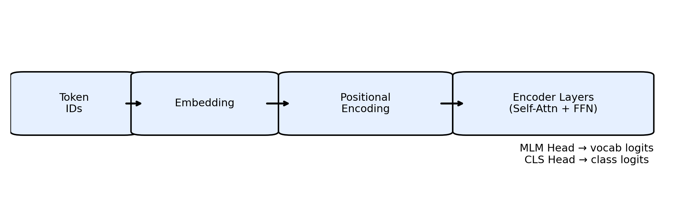
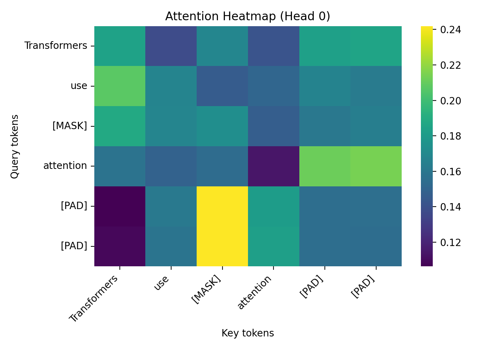

# Transformer Encoder – Autoencoding (Masked Language Model)

## Objective
Understand Transformer Encoder, Self-Attention, and Autoencoding by:
- Reconstructing masked text (MLM)
- Using the same encoder for sentence classification

## What This Repo Covers (Checklist)
- Transformer Encoder (PyTorch): ✅ `encoder.py`, `attention.py`, `positional_encoding.py`
- Masked Language Modeling (MLM): ✅ `train_mlm.py` (toy dataset), ✅ `train_mlm_wiki.py` (Wikipedia)
- Attention visualization: ✅ `visualize_attention.ipynb` + generated PNG (below)
- Compare vs feed-forward baseline: ✅ `feedforward_baseline.py`
- Sentence classification using same encoder: ✅ `train_cls.py`

## Encoder Architecture Diagram


## Autoencoding (MLM) Explanation
Autoencoding here means: you corrupt a sentence by replacing a word with `[MASK]`, then train the encoder to reconstruct the original sentence.
The Transformer Encoder uses self-attention to use *all* tokens as context for predicting the missing word.

## Sample Input/Output (Expected Reconstruction)
The following table is kept **only as a reference** (e.g., if your lab handout provided these examples). This repo’s code does **not** train on these sentences by default.

| Masked Input | Expected Output |
|---|---|
| Transformers use [MASK] attention | Transformers use self attention |
| Mars is called the [MASK] planet | Mars is called the red planet |
| Online learning improves [MASK] access | Online learning improves educational access |
| Exercise improves [MASK] health | Exercise improves mental health |
| Cricket is a [MASK] sport | Cricket is a popular sport |
| Python is a [MASK] language | Python is a programming language |
| Neural networks have [MASK] layers | Neural networks have hidden layers |
| Trees reduce [MASK] pollution | Trees reduce air pollution |
| Robots perform [MASK] tasks | Robots perform repetitive tasks |
| Solar power is a [MASK] source | Solar power is a renewable source |

## Synthetic 10-Example Dataset (Used By This Repo)
For training/running the toy “Lab” model, this repo uses an original set of 10 sentences defined in `synthetic_samples.py`:

| Masked Input | Target Output |
|---|---|
| The chef adds [MASK] to the soup | The chef adds salt to the soup |
| The train arrives at [MASK] station | The train arrives at central station |
| A telescope helps us see [MASK] galaxies | A telescope helps us see distant galaxies |
| Regular sleep improves [MASK] focus | Regular sleep improves overall focus |
| The program uses [MASK] variables | The program uses integer variables |
| Wind turbines generate [MASK] power | Wind turbines generate clean power |
| The coach plans a [MASK] strategy | The coach plans a winning strategy |
| Recycling reduces [MASK] waste | Recycling reduces plastic waste |
| The musician plays a [MASK] melody | The musician plays a gentle melody |
| The robot sorts [MASK] items | The robot sorts small items |

## Attention Heatmap Screenshot


## Sentence Classification (Same Encoder)
This project includes a tiny demo showing how the *same encoder* can do classification by adding a classifier head and using the first token representation ("[CLS]").

Run:
```
python transformer-encoder-autoencoding/train_cls.py
```

## Professional Demo App (Streamlit)
Run the unified app (Student model + BERT):
```
streamlit run transformer-encoder-autoencoding/app.py
```

## Efficient Training Workflow (Recommended)
You can keep **both** your own trained MLM and multiple **pre-trained** models:

1) Train **Lab Student Model** (fast, uses the synthetic 10-example dataset):
```
python transformer-encoder-autoencoding/train_mlm_lab.py
```

2) Train **Wiki Student Model** (slower, more general):
```
python transformer-encoder-autoencoding/train_mlm_wiki.py
```

3) Run the app and choose:
- Student (Lab-trained) or Student (Wiki-trained)
- Pre-trained model (BERT/DistilBERT/RoBERTa/BERT-large)

## Setup
Install deps:
```
pip install -r transformer-encoder-autoencoding/requirements.txt
```

## Generate README Assets (PNG)
If you don’t see the images rendering, regenerate them:
```
python transformer-encoder-autoencoding/generate_assets.py
```
